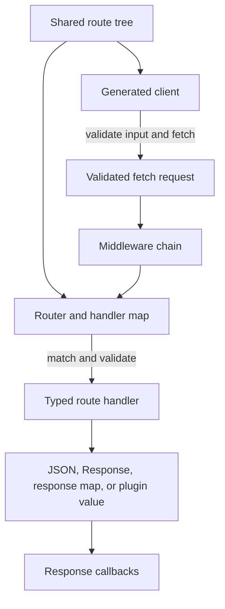

# Rouzer documentation

> Choose the guide that matches your next Rouzer decision, from defining a
> shared route contract to mounting the completed router in a Fetch runtime.

Rouzer combines a shared TypeScript route tree, a fetch-compatible server
router, a typed fetch client, and request context composition. The guides keep
those concerns separate while showing where they meet.

## Learning Path

1. Read [Framework concepts](concepts.md) for the lifecycle and boundaries.
2. Read [Route contracts](routes.md) to declare resources, actions, schemas, and
   metadata.
3. Read [Middleware and request context](middleware.md) before writing shared
   context, auth, environment, tracing, or runtime-specific middleware.
4. Read [Routers and handlers](handlers.md) to attach route trees and implement
   handlers.
5. Read [Typed client](client.md) to call the same route tree from application
   code.
6. Read [Responses, errors, and plugins](responses.md) and
   [NDJSON streaming](streaming.md) when routes need more than a simple JSON
   success body.
7. Read [Runtime and adapters](runtime.md) when mounting Rouzer in a server or
   test harness.
8. Read [OpenAPI export](openapi.md) when another language or tool consumes the
   route contract.
9. Read [Patterns, constraints, and migrations](patterns.md) before settling on
   a project structure or reviewing an integration.

> [!IMPORTANT]
> Upgrading an existing v5 application is a different path. Start with
> [Migration from v5 to v6](migration-v5-to-v6.md), then return to the focused
> guides when a changed boundary needs more detail.

## Guide Map

| Guide                                                | Concern                                                                                                                                             |
| ---------------------------------------------------- | --------------------------------------------------------------------------------------------------------------------------------------------------- |
| [Framework concepts](concepts.md)                    | The high-level model, request lifecycle, and Rouzer's framework responsibilities.                                                                   |
| [Route contracts](routes.md)                         | `rouzer/http` resources, actions, Zod schemas, raw bodies, path patterns, and metadata.                                                             |
| [Middleware and request context](middleware.md)      | `chain`, request plugins, `RequestContext`, `context.host`, env access, `waitUntil`, `onResponse`, `passThrough`, isolation, and runtime filtering. |
| [Routers and handlers](handlers.md)                  | `createRouter`, route handler maps, validated handler context, CORS, debug mode, middleware ordering, and handler return values.                    |
| [Typed client](client.md)                            | `createClient`, generated action functions, flat input objects, headers, custom fetch, `onJsonError`, and lifecycle hooks.                          |
| [Responses, errors, and plugins](responses.md)       | `$type`, `$error`, response maps, status tuples, custom `Response` returns, and response plugin contracts.                                          |
| [NDJSON streaming](streaming.md)                     | Streaming response markers, router/client plugin registration, cancellation, and stream error modeling.                                             |
| [OpenAPI export](openapi.md)                         | Zod-backed OpenAPI 3.1 generation for external client and documentation tools.                                                                      |
| [Runtime and adapters](runtime.md)                   | Root `toFetchHandler`, fetch-compatible mounting, custom host data, tests, CORS, and background work.                                               |
| [Patterns, constraints, and migrations](patterns.md) | Preferred project structure, common constraints, and migration notes from older Rouzer shapes.                                                      |
| [Migration from v5 to v6](migration-v5-to-v6.md)     | Hattip-compatible to fetch-compatible server mounting, type, test, host data, and runtime-filter updates.                                           |

## Request Lifecycle

The route tree is the shared contract. The client uses it to construct the
request, and the router uses it to validate and dispatch that request.

After response callbacks finish, the Fetch-compatible handler returns the final
Web `Response` to the runtime.

## Runnable Examples

| Example                                                                                               | Shows                                                         |
| ----------------------------------------------------------------------------------------------------- | ------------------------------------------------------------- |
| [Shared route, router, and client](https://github.com/alloc/rouzer/blob/main/examples/basic-usage.ts) | A complete JSON route from declaration through a client call. |
| [Declared status responses](https://github.com/alloc/rouzer/blob/main/examples/error-responses.ts)    | Typed success and error tuples from a response map.           |
| [NDJSON response stream](https://github.com/alloc/rouzer/blob/main/examples/ndjson-stream.ts)         | Plugin registration, streaming, and incremental consumption.  |

## Framework Surface

Rouzer owns:

- route tree declarations and handler/client type inference
- request validation from route schemas
- route matching and handler dispatch
- response markers, response maps, and response plugin integration
- generated client action functions

Rouzer middleware and runtime helpers cover:

- middleware chaining and short-circuit behavior
- request context creation and extension
- host data such as `context.host.ip` and `context.host.runtime`
- typed environment access through `context.env(...)`
- `waitUntil`, `setHeader`, `onResponse`, `passThrough`, and chain isolation
- adapter helpers such as `toFetchHandler`
